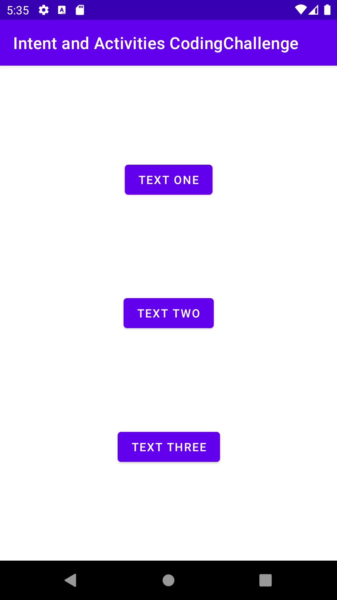
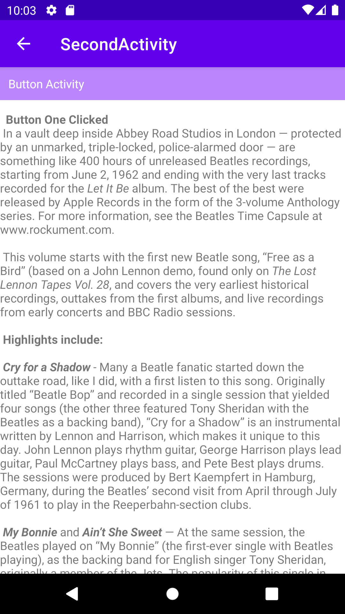
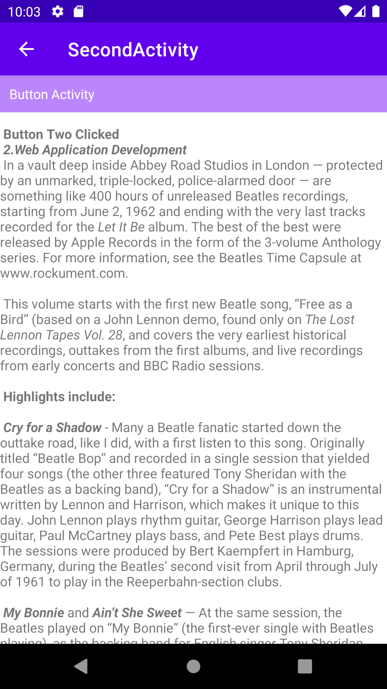
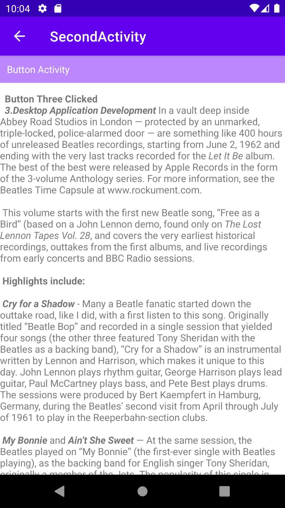

# Activity And Intent HomeWork
- In this task I have Created 3 Buttons.
- If any of these button is clicked Then it will redirect to SecondActivity.
- In SecondActivity There are String value with Scroll text view.
## Buttons to redirect.

## SecondActivity Text One

## SecondActivity Text Two

## SecondActivity Text Three

